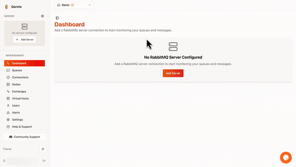

<div align="center">

# Qarote

**Open-source RabbitMQ monitoring dashboard. Free for one server, self-hosted, no credit card.**

[](https://opensource.org/licenses/MIT)
[](https://github.com/getqarote/Qarote/stargazers)

[Features](#features) · [Quick Start](#quick-start) · [Editions](#editions) · [Documentation](#documentation) · [Contributing](#contributing)

[](https://www.youtube.com/watch?v=g9Coi3niYIY)

</div>

---

## Why Qarote?

- **Zero-config monitoring** — connect and see queues in seconds
- **Free forever for one server** — MIT, no gates, no credit card
- **Self-hosted by design** — Docker, Compose, Dokku, or binary; credentials never leave your network
- **Enterprise-ready when you need it** — workspaces, alerting, SSO unlock with a license key

## Features

- **Real-time Monitoring** — Live visibility into queues, exchanges, connections, and system health
- **Beautiful Dashboard** — Modern, intuitive interface built with React and TypeScript
- **Alerting System** — Get notified about queue depths, message rates, and system issues (Enterprise)
- **Workspace Management** — Multi-user workspaces with role-based access control (Enterprise)
- **Integrations** — Slack, webhooks, and custom integrations (Enterprise)
- **Data Export** — Export queue metrics and analytics (Enterprise)
- **Self-Hosted** — Deploy on your own infrastructure with Docker Compose or Dokku
- **Enterprise Security** — Offline license validation for air-gapped deployments

## Quick Start

### Docker Compose (recommended)

```bash
# 1. Clone the repository
git clone https://github.com/getqarote/Qarote.git && cd Qarote

# 2. Generate .env with secure secrets
./setup.sh

# 3. Start services (PostgreSQL included)
docker compose -f docker-compose.selfhosted.yml up -d
```

### Binary (no Docker needed)

```bash
# 1. Download (auto-detects OS and architecture)
PLATFORM="$(uname -s | tr '[:upper:]' '[:lower:]')-$(uname -m | sed 's/x86_64/x64/' | sed 's/aarch64/arm64/')"
curl -L "https://github.com/getqarote/Qarote/releases/latest/download/qarote-${PLATFORM}.tar.gz" | tar xz --strip-components=1

# 2. Interactive setup (generates .env, tests DB connection)
./qarote setup

# 3. Start (serves API + frontend on port 3000)
./qarote
```

| Method | Guide |
| --- | --- |
| Dokku | [Deployment Guide — Dokku](docs/SELF_HOSTED_DEPLOYMENT.md#dokku) |
| Docker Compose | [Deployment Guide — Docker Compose](docs/SELF_HOSTED_DEPLOYMENT.md#docker-compose) |
| Binary | [Deployment Guide — Binary](docs/SELF_HOSTED_DEPLOYMENT.md#binary) |

## Editions

Every deployment starts with Community features. Activate a license key in **Settings > License** to unlock Enterprise — no restart needed.

| | Community (Free) | Enterprise (Licensed) |
|---|---|---|
| Core monitoring (queues, exchanges, vhosts, users) | ✅ | ✅ |
| Real-time metrics and charts | ✅ | ✅ |
| Server management | ✅ | ✅ |
| Workspace Management | | ✅ |
| Advanced Alerting (Slack/webhook) | | ✅ |
| Data Export (CSV/JSON) | | ✅ |
| Priority Support | | ✅ |

[Community Guide](docs/COMMUNITY_EDITION.md) · [Enterprise Guide](docs/ENTERPRISE_EDITION.md) · [Compare Features](docs/FEATURE_COMPARISON.md) · [Get License](https://portal.qarote.io)

## Documentation

[Documentation Hub](docs/README.md) · [Online Documentation](https://portal.qarote.io/documentation)

## Community

- [GitHub Discussions](https://github.com/getqarote/Qarote/discussions) — Ask questions and share ideas
- [GitHub Issues](https://github.com/getqarote/Qarote/issues) — Report bugs and request features
- Enterprise support: [support@qarote.io](mailto:support@qarote.io) · [Customer Portal](https://portal.qarote.io)

## Contributing

We welcome contributions! Fork the repo, create a branch, and open a pull request.

[Contributing Guide](CONTRIBUTING.md) · [Development Documentation](docs/README.md)

## Security

**Please do not create public issues for security vulnerabilities.** Email **security@qarote.io** with a description, reproduction steps, and impact assessment.

[Security Policy](SECURITY.md)

## License

- **Community Edition**: [MIT License](LICENSE) — free and open source
- **Enterprise Edition**: Commercial License — see [Enterprise Guide](docs/ENTERPRISE_EDITION.md)

## Star History

[](https://star-history.com/#getqarote/Qarote&Date)

---

<div align="center">

Built by the [Qarote team](https://qarote.io/about/)

[Website](https://qarote.io) · [Features](https://qarote.io/features/) · [Documentation](docs/README.md) · [Contributing](CONTRIBUTING.md) · [Security](SECURITY.md)

</div>
